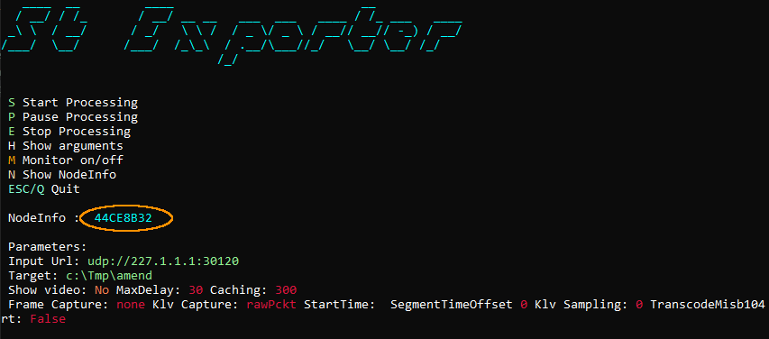

<div align="center">
  <a >
    
  </a>
</div>

# StExporter
**StExporter** - command line utility that adds MISB 0601.X metadata to a transport stream sent over UDP.  
More [info](https://impleotv.com/products/applications/stexporter/).

## System Requirements
OS: Windows 10/11 64 bit.

## Installation

**StExporter** can be downloaded as a **zip** file that contains installer.  
Unzip the **SetupStExporter.zip** file and run the **SetupStExporter.exe**  

## Download link

| Software | Version             | Download link                                                           | 
|:---------|:-------------------:|:------------------------------------------------------------------------|
| **STANAG StExporter** |  v1.3.0 | [SetupStExporter.zip](https://github.com/impleotv/stexporter-release/releases/latest/download/SetupStExporter.zip) | 

*Released on Sun, 7 Sept 2025, 13:29 GMT+3*

## License

No license is needed for SDK evaluation - it will work in demo mode (with some restrictions).

**StExporter** is a node locked software. In order to get the license (**after purchasing the SW**), please install it and fill an [online form](https://docs.google.com/forms/d/e/1FAIpQLSd_XW6bDsFce1G1cpds4gMQNlwNax0CvkWzcMbscxZ5rLaIbA/viewform), providing the ***Node Info*** string (IMPORTANT!!!) for the target machine.  
***Node Info*** string can be seen when you run the application (or press N - Show NodeInfo), as shown below.

```
C:\Program Files\ImpleoTV\StExporter\Bin\x64\StExporterProc.exe
```



Copy and paste the Node Info string into the online form, or email it to support@impleotv.com.
If your computer is offline or you're unable to copy the Node Info text, take a photo of the window with the QR code clearly visible and send it to us instead.

You'll get back a **license** file and a **key**.

Use *--licenseFile* and *--licenseKey* as arguments, for example:
```
 --licenseFile "D:\Licenses\StExporter.lic"  --licenseKey DDD8460B-8419FF85-0B36C1B5-3FC6143C
```
If a license file is in the same directory as the .exe, you can skip the path.
